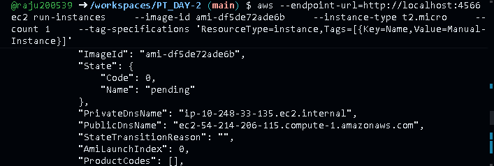
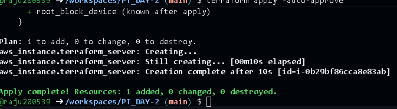

# AWS EC2 & Terraform Assignment

## 📋 Project Overview
This repository documents the process of provisioning AWS EC2 instances using two distinct methods:
1.  **Manual Provisioning:** Using the AWS Command Line Interface (CLI).
2.  **Infrastructure as Code (IaC):** Using Terraform automation.

### ⚠️ Environment Note: LocalStack Implementation
As I do not currently possess an active AWS account, I have completed this assignment using **LocalStack**.

LocalStack is a cloud service emulator that runs in a Docker container. It simulates the AWS environment locally, allowing for the execution of valid AWS CLI commands and Terraform scripts without requiring a live cloud connection or credit card. This approach demonstrates the exact same logic and syntax required for real AWS environments.

---

## 📚 Core Concepts

### 1. AWS EC2 (Elastic Compute Cloud)
EC2 is a web service that provides secure, resizable compute capacity in the cloud. It is essentially a remote virtual computer that can be used to host applications.

### 2. Terraform
Terraform is an open-source "Infrastructure as Code" tool. It allows you to define cloud resources (like EC2 instances) in human-readable configuration files that can be versioned, reused, and shared.

---

## 🛠️ Part 1: Manual Launch (AWS CLI)

For the manual launch, I used the AWS CLI to issue an imperative command to the LocalStack endpoint. This simulates the action of "clicking buttons" in the console or running ad-hoc commands.

**Command Executed:**
```bash
aws --endpoint-url=http://localhost:4566 ec2 run-instances \
    --image-id ami-df5de72ade6b \
    --instance-type t2.micro \
    --tag-specifications 'ResourceType=instance,Tags=[{Key=Name,Value=Manual-Instance}]'
```

Proof of Execution:



## 🚀 Part 2: Terraform Launch (Automated)

For the automated launch, I defined the infrastructure declaratively using a `main.tf` file. This ensures the infrastructure is reproducible.

Configuration (main.tf): The provider was configured to point to the LocalStack endpoint (http://localhost:4566) instead of the default AWS public API.

Commands Executed:

```bash
terraform init                  # Initialize the working directory
terraform apply -auto-approve   # Create the resources
```

Proof of Execution:




💻 Technical Setup
Environment: GitHub Codespaces (Cloud-based VS Code)

Simulation Engine: LocalStack (via Docker)

Tooling: AWS CLI v2, Terraform v1.x
